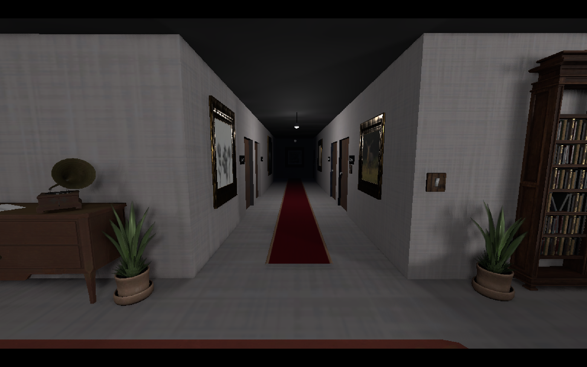
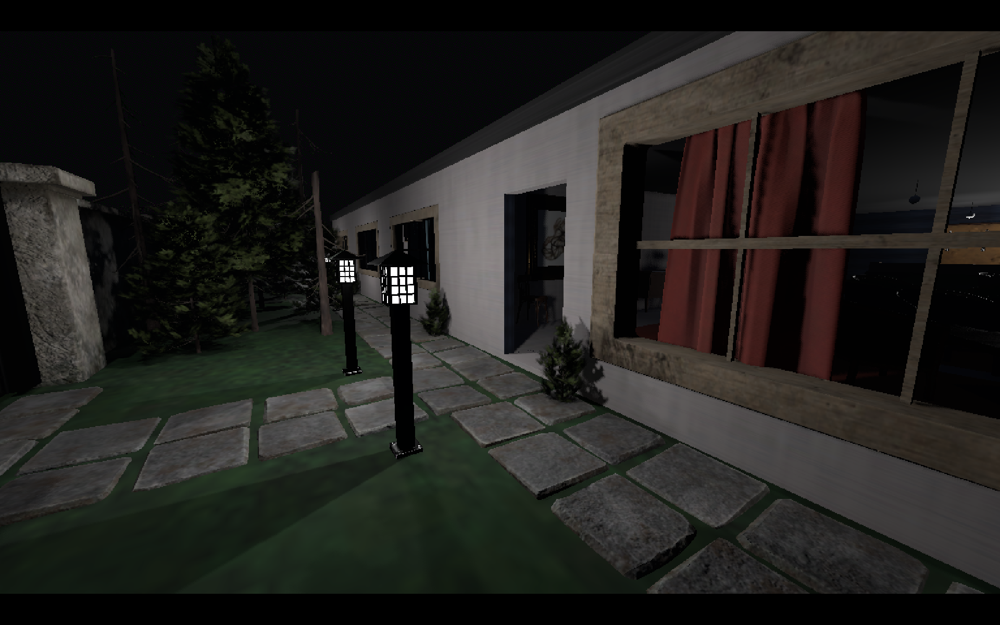
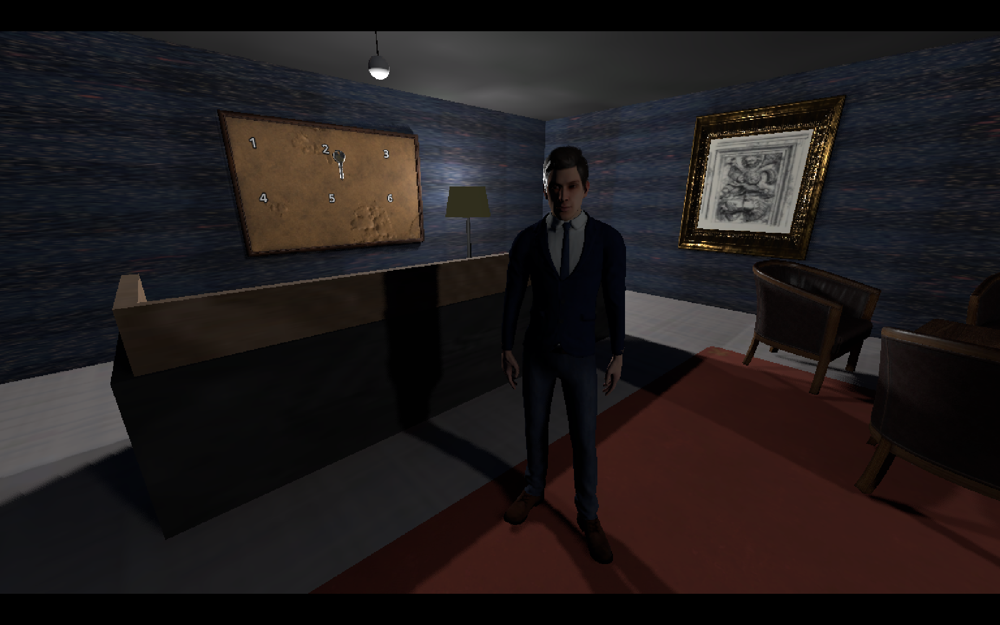
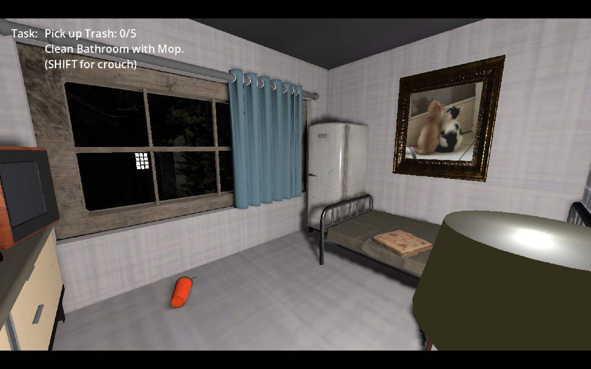
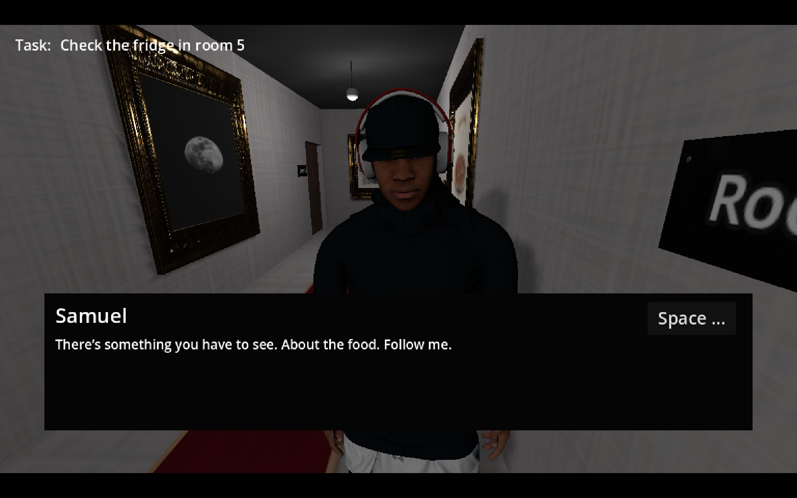
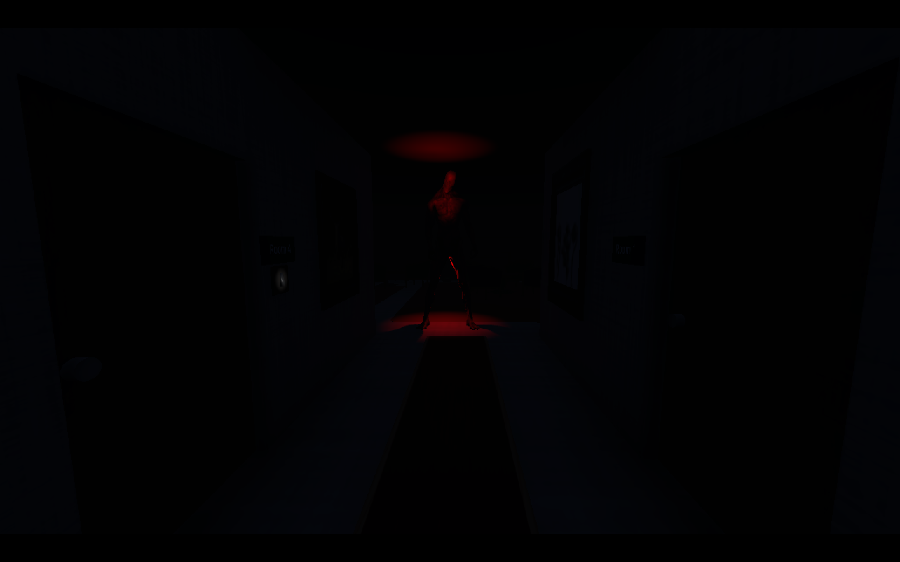

# TRAPPED
### A First-Person Psychological Horror Game

> *You came for the job. You can't leave.*

**Engine:** Godot 4.6.2 &nbsp;|&nbsp; **Tools:** Blender, Mixamo &nbsp;|&nbsp; **Type:** Solo Project &nbsp;|&nbsp; **Length:** ~45 minutes

---

## Screenshots

<table>
  <tr>
    <td></td>
    <td></td>
  </tr>
  <tr>
    <td></td>
    <td></td>
  </tr>
  <tr>
    <td></td>
    <td></td>
  </tr>
</table>

---

## About

**Trapped** is a story-driven 3D horror game built entirely solo over 4–5 months as my first game development project - learning Godot and Blender simultaneously while building it.

You play as **Ryan**, a night-shift worker who arrives at a motel to find the manager gone and a handwritten note telling you to start working. What begins as an ordinary job - checking guests in, cleaning rooms, delivering food, answering phone calls - slowly unravels into something that defies explanation.

The motel is not what it appears to be. Neither are you.

> *No spoilers. The story is best experienced blind.*

---

## Gameplay Systems

### 🏨 Job Simulation
The core loop is built around realistic motel tasks that serve as a vessel for escalating horror:
- Checking guests in and out at the front desk
- Picking up trash from rooms (tracked with a counter HUD)
- Mopping bathrooms
- Delivering food orders received via the in-game phone
- Responding to room service calls by room number
- Investigating anomalies reported by guests

### 📞 Phone System
A custom phone script (~200 lines) handles inbound calls from guest rooms. Calls assign tasks, trigger dialogue, and drive key story beats - including the call that changes everything.

### 📋 Task Manager
A dedicated task system tracks all active objectives and updates the 2D HUD in real time. Tasks sequence dynamically as the night progresses, maintaining the illusion of a real work shift.

### 💬 Dialogue Manager (Autoload Singleton)
A global dialogue manager (~130 lines) registered as an autoload, callable from any scene. Dialogue triggers contextually via Area3D proximity, player interaction, or scripted story events - displayed as a 2D overlay with character name and line.

### 🗝️ Key Board
A physical key board at the reception desk tracks room availability. Keys are picked up and returned by the player, connecting front desk management to gameplay progression.

### 👥 Characters & NPCs
- **8 human NPCs** - each with their own 100–200 line script managing movement, dialogue, and behaviour
- **6 non-human entities** - animated using Godot's AnimationPlayer with hand-authored movement; includes an eyeball in a bowl of food that rotates and tracks the player as they walk around it
- All human characters use **Mixamo** rigs and animations (walk, idle)

### ⚡ Area3D Trigger System
Area3D nodes placed throughout the environment handle spatial events: jump scare activations, cleaning zone validation, story beat triggers, and scene transitions  keeping the world reactive without constant polling.

### 🔦 Flashlight
Available exclusively in the game's secondary location. Its restricted use is a deliberate design choice to amplify tension in that environment.

### 🚪 The Room 3 Mechanic
One of the game's most technically interesting systems. Room 3 exists in two simultaneous states depending on the player's position and vantage point. Players who think to look through the garden window from outside will see something very different from what's inside. This dual-state was implemented by detecting the player's camera position in real time and swapping scene geometry accordingly.

---

## Technical Details

| System | Details |
|--------|---------|
| Player Controller | Movement, crouching (SHIFT), flashlight toggle - ~50 lines |
| Player Interaction | Raycast-based pickup, placement, and use system - ~350 lines |
| Phone System | Call sequencing, task routing, story dialogue - ~200 lines |
| Dialogue Manager | Global autoload singleton, reusable across all scenes - ~130 lines |
| Key Board Script | Room key state tracking, desk interaction - ~50 lines |
| NPC Scripts | 8 human + 6 creature scripts, 100–200 lines each |
| Task Manager | Live objective tracking with 2D HUD updates |
| Area3D Triggers | Spatial event system for scares, cleaning zones, transitions |
| AnimationPlayer | Hand-authored non-human entity animations |
| Room 3 Dual-State | Real-time geometry swap based on player camera position |

---

## Architecture & Assets

**Custom Blender work:**
- Full motel architecture (6-room layout)
- Room 3 floor cutout with descending staircase
- Reception desk

**Third-party assets (all free / CC-Attribution):**
- Characters & animations: [Mixamo](https://www.mixamo.com) (Adobe)
- Environment models: [Sketchfab](https://sketchfab.com) - CC Attribution licensed
- Audio & music: [FreeSound](https://freesound.org) - CC licensed

---

## What I Learned

This was my first ever game development project. Some of the key things I took away:

- End-to-end solo development from idea to a fully playable, story-driven game
- GDScript systems design - modular scripts, autoload singletons, event-driven architecture
- 3D level design and asset integration between Blender and Godot
- Narrative design and pacing a ~45-minute experience with intentional tension escalation
- Spatial UX using Area3D and geometry swaps to create gameplay moments tied to physical position
- Asset pipeline management across multiple free asset sources

---

## Status

This project is currently local only and not available for download.
Developed as a portfolio piece to demonstrate game development skills.

---

*Solo project - all design, code, story, and integration by the developer.*  
*Asset attributions: Mixamo (Adobe), Sketchfab CC-Attribution contributors, FreeSound contributors.*
